# Getting Started
To use Dibs, head on over to the [registration page](https://www.grabdibs.com/register) and create an account if you have not already. Additionally, you can also [download the Dibs mobile app](https://itunes.apple.com/us/app/dibs-buy-sell-unique-vintage-second-hand/id779556743) from the App Store for the premier Dibs experience.

Once you have an account on Dibs you will be able to follow along with everything described here in this User Guide.

Thanks for your interest in Dibs.

# Selling On Dibs
Everyone can sell antique, vintage, unique, and artisinal items on dibs. Dibs provides varying tools for the multiple types of sellers we commonly work with. These seller types include:

* **General Seller**  local artisans or people with some goods to sell.
* **Storefront Sellers**  folks who have anything from a small artisanal or craft business, all the way to folks with a retail shop.
* **Wholesale Sellers**  sellers who desire some privacy around content and pricing, and maintain a group of active buyers.

This document is separated into sections to address the needs and functions available to each of these types of Dibs users.

## Posting Your First Item
Selling on Dibs could not be easier! You simply take a picture, add pricing and description information, and post it. 

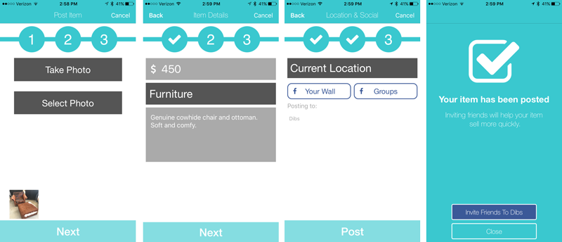

### Step 1. Take A Picture
The first step is to either snap a few new pictures of the item you want to sell, or choose some great pics from your camera roll. You can add up to five pictures per post. 

<aside class="notice">
You should have only a single item per post, don't try and put five pictures of different items into a single post, because you get a single description and price for the post. 
</aside>

#### Quality Pictures
Choose clear, well lit images that highlight the best features of your items. The picture is what is going to sell your item, so make it great! As your item price increases, multiple pictures are a virtual requirement to provide the buyer with enough information to engage in the sale.
### Step 2. Add a Price and Description
The next step is to add the details about your item to the post.  On this screen you will be able to add the following information to your post:

- Price
- Category
- Description

After adding these details to your post, you can proceed to the next step.

### Step 3. Post Destinations 
The final step for posting an item allows you to set the location for the item being posted and share your item into your Facebook feed or to a Facebook group that you are a member of.  If you tap on either of these buttons, you will be required to login with Facebook (if you are not already). 

#### Location
By default, the post will be created at your current location. This is great if are at the same place where the item is being sold, however in some situations you may want to post from a different location. For example, you tap the button that says "Current Location" and then move where the item will be placed. Also, this is a great option if you are posting inventory for sale at a retail store, but you are sitting at home while posting the item.

#### Facebook
Sharing to your own feed is a great way to let your Facebook friends know about your item.

Sharing to a Facebook Group is a great way for you to target other like minded folks, and gain a broader audience for your item. 

If you don't want to share your feed on Facebook then you can just proceed to the next step, which will save your post.

### Viewing Your Finished Post
When the post is complete you will receive a message telling you of the success. Dismiss this screen.
<aside class="notice">
Note, if you wish you can also invite Facebook friends from this screen. This will share the link for the item you just posted to the people you invite so they can see what you are selling.
</aside>

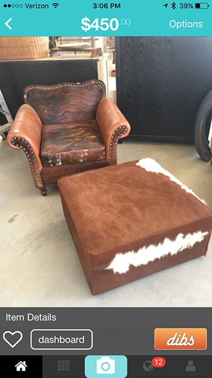

### Viewing Items You Are Selling
When you return to the main app screen:

- use the tab bar at the bottom of the application to go to your User Profile. 
- Tap the far right person shaped tab to do this. 
- Once you are there you will see your Profile, and near the middle of the screen you will see a tab section that includes these labels; Social, Buying, Selling, & Favorites. 
- Tap on the Selling tab and you will see your item in the grid below. 
- Tapping on an item in the grid will take you to the item detail view where you have additional options related to your post.

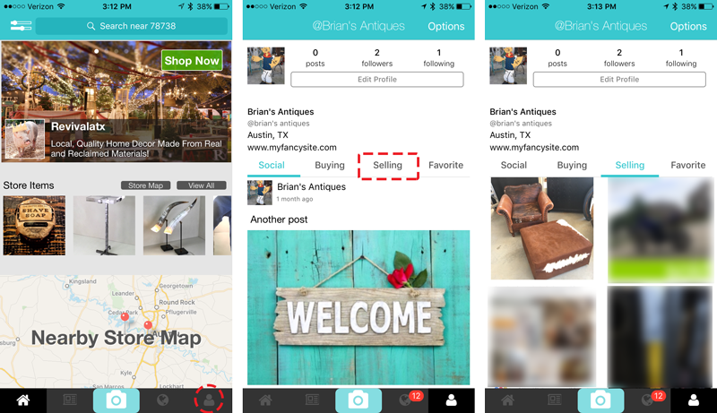

### Sharing Your Post With A Bigger Audience
You have several options for how to share a post with others and grow the audience for the item. Posts can (or will be, depending on the type) be shared in the following manners:

- Shared with your followers
- Shared via friend invitations
- Shared through Facebook
- Shared with the IOS Share Sheet

#### Sharing with followers
Whenever you post an item, it is shared with your followers. This means that when your follower opens the app, they will see your item in their various feeds (as applicable by location or filter). 

People can find you and follow you in app by navigating to your items or your profile and tapping the follow button. You should encourage your friends to follow your account, as it helps grow your audience for your posted items. 

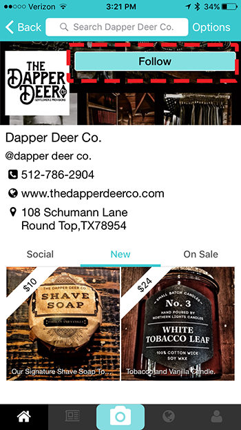

#### Sharing via friend Invitations
You can also send email invitations to people in your address book and grow your follower base that way. There are two simple ways to send email invitations via Dibs. 

You can navigate to the Social Feed tab, in the bottom tab bar, and once you are on the Social Feed you will see a person shaped icon on the left side of the Navigation Bar. Tap that icon and it will bring you to the email invitation screen. 

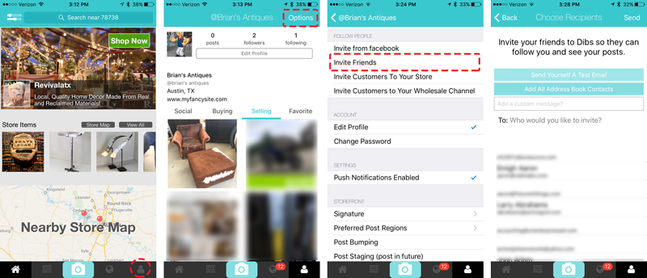

<aside class="warning">
Please accept the iOS permissions that lets Dibs read your address book. Without doing this, you will not be able to send email invitations from within the app.
</aside>

The email invitation screen allows you to choose emails from your address book, manually enter email addresses, and send a test email to yourself so you can see what the email looks like before inviting your friends.

You can also use the Tab Bar at the bottom of the application and go to your User Profile. Once you are at your User Profile, tap the 'Options' button in the top right of the Navigation Bar. This will bring you to the User Profile Options screen, where you can access the following invitation systems depending on your current User Role on Dibs:

| Invitation Type                 |Description                                                                                                                                                                                                                                                                  |Required Role                      |
| ------------------------------- |---------------------------------------------------------------------------------------------------------------------------------------------------------------------------------------------------------------------------------------------------------------------------- |---------------------------------- |
| Friend Invitation               |Allows you to invite friends via email. These friends will receive an email to download the app and find you on Dibs.                                                                                                                                                        |Any Registered User                |
| Storefront Customer Invitation  |Allows Storefront sellers to invite customers to follow their store. The email will contain a direct link to the store so the customers can easily find it and follow you.                                                                                                   |Registered Storefront Users        |
| Wholesale Customer Invitation   |Allows Wholesale Sellers to invite customers to their private sales channel. This will require the wholesale seller to approve all users access once they accept your invite. In this way you have total control over who has access to your wholesale pricing and products. |Registered Wholesale Selling Users |

#### Sharing through Facebook
Once you post an item, an item posting success screen appears with a "Invite Friends To Dibs" button. Tapping this button will bring up the Facebook Invitation Share Sheet, and the invite from you will include a link from Facebook to download and install Dibs. This will help you get your friends on Dibs.

#### Sharing with the iOS Share Sheet
Probably one of the most robust sharing solutions in the app, is the IOS Share Sheet. To access the Share Sheet, you simply navigate to an item you own and tap the 'Options' item on the top right Navigation Bar. Choose the 'Share' option and the iOS share sheet will be presented. 

This Share Sheet behaves exactly like all other IOS Share Sheets and allows you to access a variety of ways to share, that vary based on what is installed on your device.

However, one of the most flexible items in the Share Sheet is the 'Copy' item. This item will provide a deep link directly to your item, that can be shared over any medium.

### You Are Finished!
Great job, now you know how to post items, view them, and invite friends to view them as well! Now you can get to selling!

# Managing Items
When you have items published on Dibs, there are several reasons why you may want to make changes to that item. This section of the document covers a few of the supported item change types.

## Editing Items
There are several fields that can be edited once a item has been published. To edit an item, just navigate to an item that you own and tap the 'Options' item in the top right Navigation Bar. Once the Action Sheet appears, then you can choose the 'Edit' item and you will be brought to the Edit Item screen pictured below.

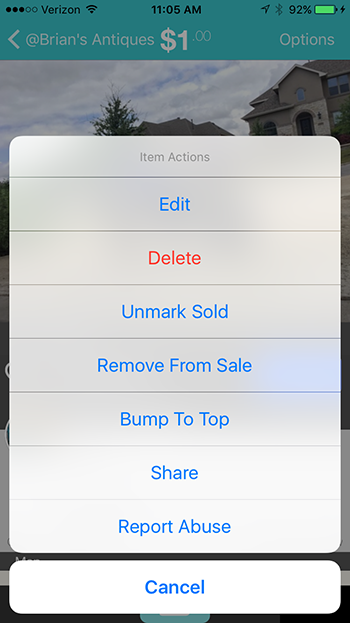

The editable fields include the following items:

- Price
- Description
- Category
- Location

If you need to change fields beyond those, then you will need to delete this item and repost it with the required changes.

## Deleting Items
To delete an item, just navigate to an item that you own and tap the 'Options' item in the top right Navigation Bar. Once the Action Sheet appears, then you can choose the red 'Delete' item and you will be asked to confirm your intention. Once confirmed, your item will be deleted.

## Marking Items Sold
When your item sells, or you have depleted all available quantity then you can mark the item as sold. Marking the item sold will not remove it from your profile/storefront/search, but will prevent people from attempting to purchase it moving forward. In this way, inventory is kept around to help you advertise the culture and tone of the items you carry, which will help you build your following on Dibs.

To mark an item sold, just navigate to an item that you own and tap the 'Options' item in the top right Navigation Bar. Once the Action Sheet appears, then you can choose the 'Mark Sold' item and your item will display the sold indicator.

If for some reason you need to put the item back on sale, you can simply follow the same path to the item options and the options will change for an item already marked sold, and will display 'Unmark Sold'. Choose this potion to put it back into the unsold state.

# Dibs for Storefront Sellers
Dibs offers customized storefronts for local artisans, craftsmen, sellers of antiques, vintage, and unique items. These storefronts allow you to have a place where you can:

- Be discovered on the Dibs map by local customers
- Have your store appear in in-app advertisements to reach new customers
- Allow local customers to grab dibs and come by to pickup the items (or ship if you support that too)
- Simplify selling your items with electronic payment through Dibs.
- Have a beautiful storefront for both web and mobile.
- Enjoy unique ways to interact with customers and grow their imaginations.
- Reach new customers that you might have had difficulties reaching before.
- Increase your sales.

Below is a sample storefront as seen on the iPhone.

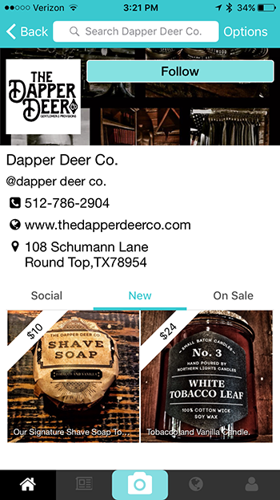

After you have created your store, you will receive a registration email with further details about configuring your account. You will immediately be added to the Dibs map, and you will be considered for placement on the in app Home Screen banner.

This section of the document discuss the tools that are available for storefront sellers on Dibs.

## Creating Your Storefront
There are two ways to gain access to all the benefits of a Dibs storefront. 

- You can [create your storefront via our web site](https://grabdibs.com/storefront)
- Or you can create it in our mobile app

Ultimately, you will want to login to the mobile app to finalize the completion of the creative assets of your storefront, but web is a simple way to get started ASAP.

### Creating on web
You can create your storefront on our web site by visiting this page:

- [https://grabdibs.com/storefront](https://grabdibs.com/storefront)

The top part of this form requires you to signup or login. You can choose either path depending on if you already have an account, however the bottom portion of this form will not be editable until you have a active and logged in Dibs user.

There are several fields on this registration form that will activate once your authenticated to Dibs and the below table will provide a description of what they will do:

|Form Field          |Description                                                          |  Required  |
|------------------- |-------------------------------------------------------------------- | :--------: |
|First Name          |The Business owners first name. This will not be publicly displayed. |  Y         |
|Last Name           |The Business owners last name. This will not be publicly displayed.  |  Y         |
|Business Name       |The Business name. This will be displayed as your store name in app. |  Y         |
|Website             |Your website address, if you have one.                               |  N         |
|Street Address      |The street address for the business. This combined with the other address fields are what will show you on the Dibs map. So be sure to include your proper location.|  Y         |
|City                |The business city.|  Y         |
|State               |The business state.|  Y         |
|Zip                 |The business zip.|  Y         |
|Email Address       |The business email address.|  Y         |
|Phone               |The business phone number.|  Y         |
|Tax Identifier      |The business tax identifier. This is optional, however if you apply to become a wholesale customer, you may be required to enter one for the wholesaler you are applying for.|  N         |
|Shipping Options    |Check this box if you want to provide shipping options to your customers. This will be displayed publicly.|  N         |
|Community Standards |You need to check this to confirm you agree to our community standards.|  Y         |

Once the form is complete and submitted, we will email you a confirmation message. From this point, you should consider adding your banner image and profile image to help your store stand out from the rest.

### Creating on Dibs mobile app
You can also create your storefront on the Dibs mobile app. Navigating to the storefront creation screen is easy. 

- You will need to signup or login to Dibs.
- Then tap on the User Profile Tab in the lower right of the Tab Bar. 
- Then tap on the 'Create Your Store' button located at the top of your profile.

This will take you to the storefront creation screen. Once you are at this screen you can complete the fields, in a similar manner to how it is described in the [Creating a Storefront On Web](#creating-on-web) section above. 

However, this form also allows you to add a banner image and a profile image to your store. You can see a sample of a completed store form (left), and the resulting store profile pictured (right) below.

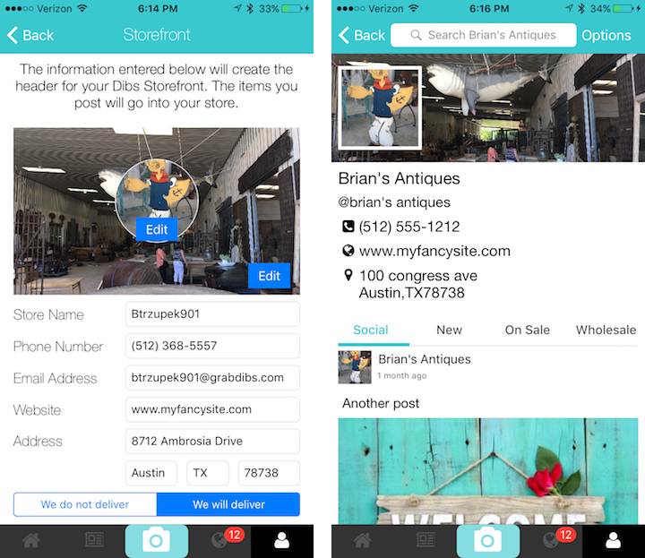

After you have created your store, you will receive a registration email and your store will appear on the Dibs store map at that time. It is time to start posting some items, and inviting some customers now!

## Adding A Banner Image 
(Banner setup can only be done from within the Dibs mobile app)

If you created your storefront from the web site, then you will need to add your banner image using the mobile app. Additionally, you can edit your current banner image at any time by following these same instructions. To locate the store front edit screen do this:

- You will need to signup or login to Dibs.
- Then tap on the User Profile Tab in the lower right of the Tab Bar. 
- Then tap on the 'Options' button located at the top right in the Navigation Bar.
- Then scroll to the bottom of the Options Screen and you will see the 'Storefront' item. Tap it to edit your storefront.

Once you are on the storefront edit screen, you can tap on the Edit button by the banner image. This will allow you to choose or take a photo for the banner. Once you have a photo you like, tap the 'Save' button and the image will be applied to your storefront. (you can also tap back and avoid changing anything associated with the storefront.)

<aside class="notice">
The Banner image will be used across the web app, mobile web, various iPad screen resolutions, and various iPhone resolutions. You will want to use an image that has a landscape orientation and a 16:9 aspect ratio. A suggested minimum pixel size is 1920x1080, this will help avoid pixelation on larger display types.
</aside>

The chosen image will be displayed in an "Aspect Fill" format. This means that the width of your landscape image will always reach edge to edge of the banner view, but it will display vertically centered. If the image height is greater than the presented height, then the top and bottom pixels will be cropped. An example is below.

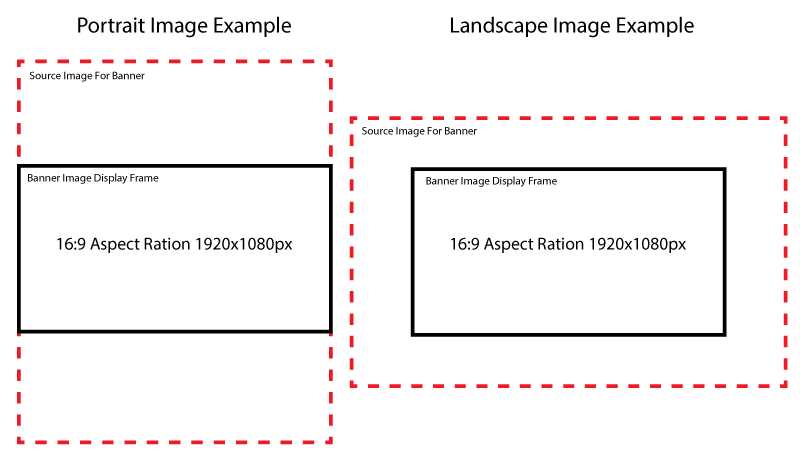

## Adding A Profile Picture
(Profile picture setup can only be done from within the Dibs mobile app)

If you created your storefront from the web site, then you will need to add your profile image using the mobile app. Additionally, you can edit your current profile image at any time by following these same instructions. To locate the store front edit screen do this:

- You will need to signup or login to Dibs.
- Then tap on the User Profile Tab in the lower right of the Tab Bar. 
- Then tap on the 'Options' button located at the top right in the Navigation Bar.
- Then scroll to the bottom of the Options Screen and you will see the 'Storefront' item. Tap it to edit your storefront.

Once you are on the storefront edit screen, you can tap on the Edit button by the profile image. This will bring you to the Profile Edit Screen, where tapping on the Edit Picture button next to your profile images allows you to choose or take a photo for the profile image. Once you have a photo you like, tap the 'Save' button and the image will be applied to your profile and storefront. (you can also tap back and avoid changing anything associated with the storefront.)

<aside class="notice">
The Profile Image will be used across the web app, mobile web, various iPad screen resolutions, and various iPhone resolutions. You will want to use an image that has a square orientation (if possible) and a 1:1 aspect ratio. A suggested minimum pixel size is 1080x1080, this will help avoid pixelation on larger display types.
</aside>

The chosen image will be displayed in an "Aspect Fill" format. This means that the image will be displayed centered vertically and horizontally in the image container, with the smallest (horizontal or vertical) dimension matching the same display dimension and the other dimension (if greater) being clipped outside the image region.

## Adding Store Details
(Modifying store details can only be done from within the Dibs mobile app)
Include web, address, phone, etc

You can always go back and edit your store details. To do so follow these instructions:

- You will need to signup or login to Dibs.
- Then tap on the User Profile Tab in the lower right of the Tab Bar. 
- Then tap on the 'Options' button located at the top right in the Navigation Bar.
- Then scroll to the bottom of the Options Screen and you will see the 'Storefront' item. Tap it to edit your storefront.

This [screen is pictured in the above section](#creating-on-dibs-mobile-app) as well.

## Sending Customer Invitations
(Customer invitations can only be sent from within the Dibs mobile app)

You can automate inviting friends and customers to your new Dibs storefront by using the tools available in the Dibs mobile app. You can find the sharing tools by following these steps:

- You will need to signup or login to Dibs.
- Then tap on the User Profile Tab in the lower right of the Tab Bar. 
- Then tap on the 'Options' button located at the top right in the Navigation Bar.
- Then at the top of the Options Screen you will see the 'Invite Customers To Your Store' item. Tap it to go to the Invitation Screen.

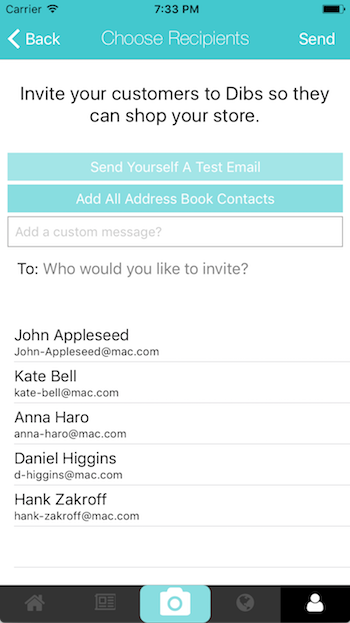

Once you are at the Invitation Screen you will have a few ways you can interact with it. 

- **Send Yourself A Test Email**- You can send a test email to your own email address, to see what your customers will see.
- **Add All Address Book Contacts**- You can add every email address from your Address Book on your device. 
- **Add A Custom Message**- You can add a custom message that will be included in the email sent to your chosen recipients.
- **Add Recipients**- You can choose recipients from the listed recipients on the bottom half of the screen or you can manually enter email address in the "To:" field.

When you have entered your message and chosen your recipients, then tap the 'Send' button and the email(s) will be sent to the chosen recipients.

The email includes a download link for the app and a link to your storefront with instructions for the recipient to begin following you on Dibs.

## Advanced Selling Tools For Storefronts
One of the major reasons to signup as a Dibs storefront is that you gain access to several advanced seller tools that are not available with a general seller account. This section of the document describes these tools.

## Selling Items
There are several tools available for when a storefront  is selling items on Dibs .

#### Dibs

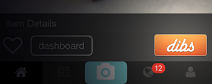

The Dibs button is the major interaction point for all items posted on Dibs. When a buyer taps this button, they are saying they want the item and that the seller should hold it for them. Once this button is tapped, the system will bring the buyer and seller together into a private chat session to make final arrangements for the item. This is a good time to work out payment, pickup, or shipping options.

#### Buy It Now
As a storefront seller, you also gain access to the 'Buy It Now' button. This button is enabled when an item is posted and the seller enables this option. This is a per item option, not a per account option.

When a buyer taps this button, they are taken to a checkout screen where they will see the price and description for the item and they will have the option to enter their purchasing information and make final payment.

When the payment is cleared both the buyer and seller receive receipts of the transaction so that they can finalize the transaction. This can include the pickup or delivery options, depending on how the item was sold.

<aside class="notice">
Before using the buy it now button, you should get in contact wtih Dibs directly so that we can ensure that payments will flow properly to your banking system. Without this setup, we will hold the money until it clears and make payment to the seller as described in our Terms and Conditions.
</aside>

## Inventory Management
At Dibs, we recognize that our customers have an extremely fluid inventory situation - often with inventory 'surprises' that can change dynamics extremely quickly. 

We have an inventory tracking solution for you If you utilize unique item identifiers, bar codes, or QR codes for tracking your items. 

When posting an item, at step two, there is an option for a 'Store Item Identifier'. You can manually enter any identifier you wish, however if you tap on the camera icon in the 'Store Identifier' inout box you will be presented with our barcode/QR scanner. 

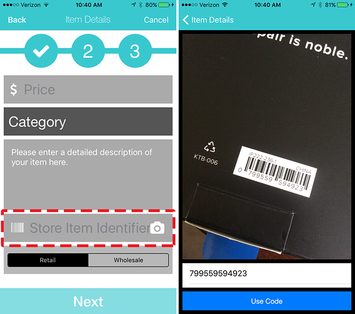

Simply place your items barcode or QR ticket under your camera and it will automatically pull in the identifier and add it to your item.

Later, as inventory sells (perhaps through other channels like your physical store) you can simply search your inventory by identifier and mark the item sold in Dibs. This will keep the item listed on the system, but clearly show that it has been purchased and it will prevent customers from attempting to buy it again. However, leaving the item there is excellent advertising for your store, and you may see customers come back with inquiries on sold inventory that may influence your future purchasing decisions.

## Customer Targeting
Dibs storefront sellers can employ advanced targeting mechanisms to reach customers where **they** are located.  We realize that many Dibs customers have regional areas where customers travel **from** to come to their stores and purchase items. Using our advanced targeting mechanism allows your items to appear in geographic areas where you want to find new customers, while leading those customers back to your store or online purchase. 

When posting an item, on step three, you will have the option to enable the option to 'Place in preferred regions'. In the image below, this option is enabled. This will cause your item to be placed randomly inside the predefined regions you create.

You can create regions by navigating to your Profile Options and tapping on the 'Preferred Post Regions' option. Once at the Preferred Region Editor screen, you simply tap the '+' button to add a region, drag it to where you want it centered, and use the slider at the bottom to define the size of that region.  You can add as many as you like. You can tap a region pin, and then tap the '-' button to remove a region you no longer want.

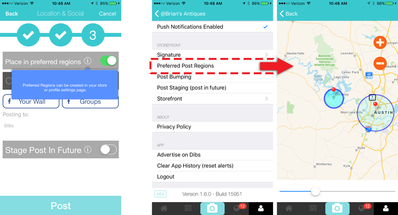

## Staging Posts
When posting items as a storefront, it may be desirable to have a delay before the post goes live to the public.  To accomplish this, when posting an item (on step three) you can enable the 'Stage Post In Future' option. Doing so will bring up a date picker where you can choose the date and time when you desire the post to go live. Then complete your post as normal.

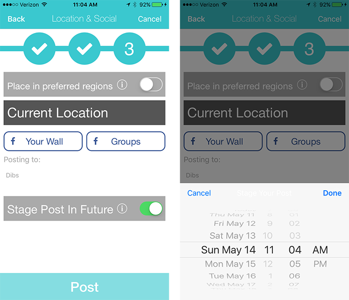

## Bumping Posts
Storefront sellers have the unique capability to 'bump' posts to the top of the feed. This can drastically improve visibility for your items as you will likely be page 1 for searches and filters that find your item.

Bumping a post is accomplished by navigating to an item that you posted, and tapping the 'Options' button. When the Action Sheet pictured below appears, you simply need to tap 'Bump To Top' and your post will be moved to the top of the relevant feed.

## Custom Signature
You can add a signature block that will be automatically included in all your posts, for example to include information about store policies or shipping details. You can create a signature block by navigating to you Profile and choosing the 'Options' button. In the Options Screen you will see a 'Signature' item. Tap it and you will be brought to the signature editor. Here you can create, modify, or delete a signature.

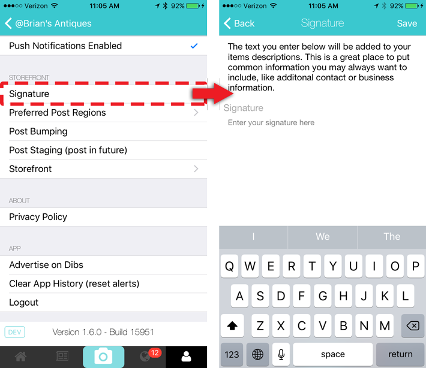

## Local Advertising 
When we find great items that we think would be interesting to our users, we will often include your store name, links, and items in those advertisements. This can include advertising we perform to generate application installs, or new user registrations, or re-engagement advertising, or simply promotional pieces that we do from time to time. 

Once you are a storefront, you qualify to be include in this free advertising when we choose to do it. 

### Home Screen Banners
The Home Screen of the app has a large scrolling banner at the top that contains 'Advertisements' for storefronts that are on Dibs. They storefronts displayed are chosen based on the users proximity to the store, position scoring factors we set, and searches the customer performs. 

Once you are a Dibs storefront seller, you qualify to be placed in this prestigious position. Dibs makes final decisions on what stores get placed here, but our decision is mostly based on the quality of items that you are posting. 

If you are interested in appearing in this section of the app, please contact us at advertising@grabdibs.com.

### Dibs Advertising Network
The Dibs Advertising Network (DAN) is a complete local business advertising solution for local service providers and sellers of unique, vintage, antique and artisanal items. Contact us at advertising@grabdibs.com to learn more about how you can promote your business or service to our customers.

We curate our advertisers pretty aggressively. For example, we will not accept national brand advertisers or chain stores. That goes against our focus on small business. 

You can learn more about advertising options at https://business.grabdibs.com

# Dibs For Wholesale Sellers
Dibs provides features and tooling to directly simplify and automate the work of estate sellers, importers, and antique wholesalers. Registration of a wholesale account is free and you can follow the steps below to configure your account. 

The wholesale tools from Dibs provide many benefits including:

- All of the advanced functionality that comes with a Dibs Storefront. (See the above section for more information on storefronts)
- A private and invite only sales channel, where your items, pricing, and customers are all protected from disclosure to the general public.
- A simple way to announce new inventory, and get the items in front of your buyers.
- Electronic purchasing, so you can increase sales from your buyers that would take advantage of this buying process.
- Easy ways to show your inventory to geographically targeted locations.
- Provide certainty to buyers in their purchases, where a dynamic and uncertain environment may exist today.

The first step to realizing these benefits is to register for Dibs Wholesale.
## Registration For Dibs Wholesale
Registration is easy and won't take more than a few minutes. The Dibs Wholesale registration process is a web only process at the moment, and you can [being that process here](https://grabdibs.com/info/wholesale). Tap the 'Sign Up Now' button at the top of that page and you will be taken to the registration form.

There are two main steps to registration, logging into or creating a Dibs user account and supplying your wholesale seller information.

### Login or Create A Dibs Account
If you have an existing login with Dibs, then supply your username and password to gain access to the remainder of the registration form. 

If you do not have an existing account, then click the "Sign Up" button and register for a Dibs User account. 

Once you have logged in or registered, you will be brought back to this form to complete the second half of this registration form.
### Supplying Registration Information
The table below provides details on the form fields and information on what is required or not.

|Field              |Description                                                                                                                                                                                                   |Required|
|-------------------|------------------------------------------------------------------------------------------------------------------------------------------------------------------------------------------------------------- |:------:|
|First Name         |The first name of the store owner.                                                                                                                                                                            |Y       |
|Last Name          |The last name of the store owner.                                                                                                                                                                             |Y       |
|Business Name      |Your business name, which will appear as your "screen name" in the app.                                                                                                                                       |Y       |
|Website            |Enter your website here. It will display on your storefront.                                                                                                                                                  |N       |
|Street Address     |Enter your business street address. It will display on your storefront.                                                                                                                                       |Y       |
|City               |Enter your business city. It will display on your storefront.                                                                                                                                                 |Y       |
|State              |Enter your business state. It will display on your storefront.                                                                                                                                                |Y       |
|Zip                |Enter your business zip. It will display on your storefront.                                                                                                                                                  |Y       |
|Email Address      |Enter the email address that you use for your store. This will display on your storefront.                                                                                                                    |Y       |
|Phone              |Enter your business phone number. This will display on your storefront.                                                                                                                                       |Y       |
|Tax Identifier     |Enter your tax Identifier, if you wish to automate payment process with us, this is your first step.                                                                                                          |N       |
|Shipping Options   |Check this box if you want to provide shipping options to buyers. If you do not want to provide shipping options then people will have to pickup the item locally. This will be displayed on your storefront. |Y       |
|Community Standards|Checking this box acknowledges that you agree to post content that meets our community standards.                                                                                                             |Y       |

After you have completed the registration form and submitted it, you will now have an active wholesale channel.

<aside class="notice">
Dibs will monitor the content of your channel to ensure it meets community standards. If it does not, then we will be in contact to help return the store to compliance.
</aside>

You are now ready to finish the setup of your storefront, posting inventory, and inviting customers to your private channel.

**Please note** that you will want to also visit the [Storefront section](#creating-your-storefront) of this document to [add your store profile picture](#profile-picture) and to [add your store image banner background](#banner-image). Once you have your store details, profile image, and banner image complete - you should feel confident to show off your storefront and begin inviting your buyers.

Lastly, you will also receive an email after you finish your registration. This email will contain instructions for you to being using your new channel as well as all the custom links for you to send to your customers, if you should decide to do that on your own and not use the tooling in the app.

## Advanced Tools For Wholesale Sellers
Aside from the advanced storefront seller tools that you get when create a wholesale seller account, there are several other impactful tools that you can use as a wholesale seller. This section describes those tools.

## Your Private & Invite Only Sales Channel
The private sales channel is what is **key** to the Dibs wholesale seller system.  When you post items to your private channel, they remain private and hidden from public view. Items posted to your private channel are only visible to the people you invite to your private channel, and no one else. 

When you post new items to your private channel, all the associated new item notifications will be sent to the validated subscribers of your private channel.

## Customer Invitations (Private Channel)
You can invite customers to your private channel via email. By Inviting customers to your private channel, they will be able to receive new item announcements from your store, view wholesale items, and purchase wholesale items. 

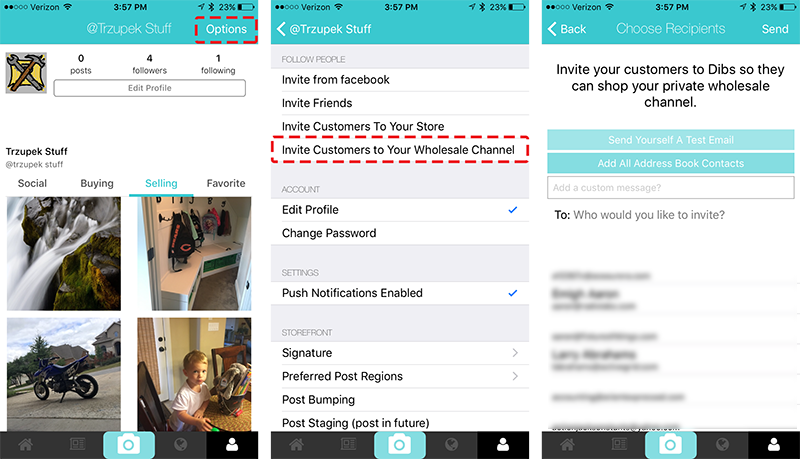

The invite will have a custom link that will take your customer directly to a personalized (for your private wholesale channel) subscription page. From this page your customers can provide details on their store and submit the request to your for approval. 

The requests will be sent via push notification to your app, and will also be emailed to you. When you receive these requests, you will need to review the customers details and then either approve or deny their access. Either action will then notify the user of your decision and either grant or deny access to your private channel.

You can always access their approval requests at a later time and change their enrollment status, should the need arise to do so.

You can invite customers to your private channel by following the  [directions provided here](#sharing-via-friend-invitations).

## Customers Access Requests
The customer invitation process offers two points of control, to ensure that only the folks you invite are allowed access to your channel.  These control points include:

- You must send your custom invite link to your customers.
- You must also 'accept' their invitation request once they have completed the registration form.

The invitation approval screen is pictured below. This screen allows your to perform just a few simple actions, including:

- Reviewing the user information from the requesting customer.
- Approving the request, which allows them access to your channel.
- Declining the request, which declines or removes their access from your channel. 
- Closing the request, so that you can review it further later. In this case, no action is taken and the customer is left in the access state they had when you entered this screen.

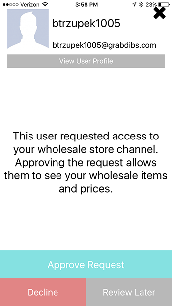

You can always go back to your Notifications Tab (in the app) later, and manage requests or remove access if your situation changes. 

## Selling Items

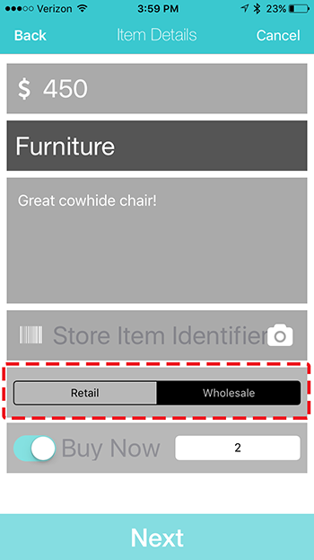

There is a single, yet important, difference when posting items intended to go to your private wholesale channel. The difference is that you will want to explicitly mark the item as a 'wholesale' item. You do this on the second selling screen (pictured below), at the bottom there is a button that allows you to toggle the post between 'Retail' and 'Wholesale'. By choosing the 'Wholesale' option, the item will be posted to your private wholesale channel and become visible to only those customers with access to your channel. The remainder of the selling process is unchanged for selling items to wholesale. 
## Buy Now and Quantity
When the wholesale channel is selected for your item being posted, you have the option of enabling 'Buy It Now' for that item. This option will allow your customers to complete the purchase of the item, electronically in the app. Upon completion of the transaction, both the seller and buyer will receive follow on notifications so the item shipment, delivery, or pickup can be arranged.

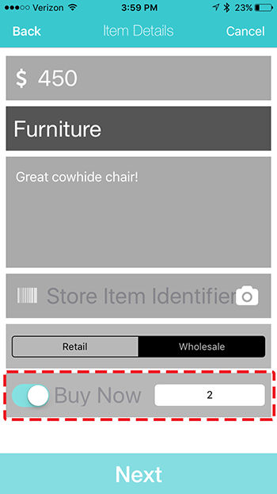

When 'Buy It Now' is enabled, you also need to input an inventory quantity. Please enter whatever quantity you are willing to commit to the Dibs sales channel, as you can hold other inventory for additional sales channels you already use.

If 'Buy It Now' is not enabled, then the default 'Dibs' button will appear for the item. As usual, this button indicates that a Customer would like to purchase the item and when they grab dibs on an items, both the seller and buyer will be ushered into the private chat system to arrange the final details of their transaction.

<aside class="notice">
Buy It Now transactions are subject to the transaction fees listed in our [terms and conditions documents](https://dev-dibs.grabdibs.com/terms-of-use). So take these fees into account when you price and place your item on the Dibs wholesale platform.
</aside>

When the available quantity for an item has been purchased, the item 'action button' will return to the 'dibs' button. This will allow you to continue to garner interest for the item, should you have additional inventory or ordering capacity. However, if you have sold all items and have no ability to fulfill additional orders, then it is best to [mark the item sold](#marking-items-sold). This will still allow customers to see the great types of items available in your store, but it will not allow them to purchase or grab Dibs any longer.

## New Item Announcements
Announcements provide a way for you to "show" your new inventory to your customers and buyers, through one easy interaction. The best part is that Announcements have a built in "sales funnel" to help drive new and additional purchases from existing customers. Announcements help you keep your store in the front of your customers minds.

### Step 1. Begin Announcement
To begin creating an announcement you will have to use tap the 'camera icon' on the Tab Bar at the bottom of the mobile app. This will bring up the screen that allows you to create an announcement, or begin posting an item. Tap the 'Announce Items' button to begin creating an announcement.

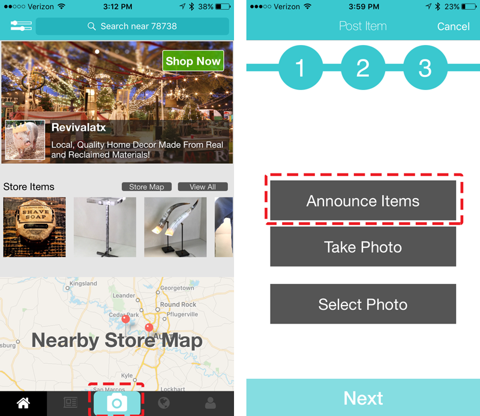

### Step 2. Choose Items
Now you will be presented with the option to 'Create A List' or 'Choose an Existing List'. A 'List' is a collection of items and recipients that you want to send an announcement to. Lists get saved when you are done creating announcements so that you can easily resend the same batch of images to new recipients, or a whole new batch of images to the same set of recipients.

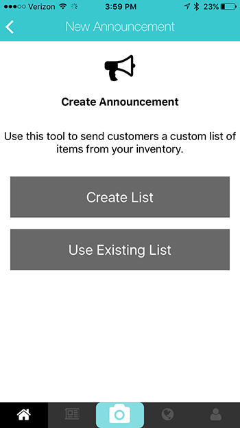

For purposes of this document, we will assume that you are going to 'Create A List' and start fresh. Tap 'Create A List' and you will be presented with a list of items you have posted to your wholesale channel. Newest items are at the top. You can tap the items that you want to add to the Announcement. Add as many items as you like. 

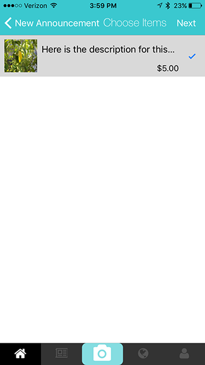

<aside class="notice">
If there are no items in the list, this means that you have not posted any items in your wholesale channel yet. Go post items in your wholesale channel and then come back to create your announcement.
</aside>

Once you have chosen all your items, then tap the 'Next' button in the top Navigation Bar to continue to the next step.

### Step 3. Choose Recipients
This screen will allow you to configure who the Announcement will be sent to. Starting from the top, here is a description of the options on this view.

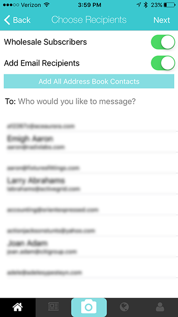

|Option                                |Description                                                                                                                                                                                                                                                                                                                                                                    |
|--------------------------------------|------------------------------------------------------------------------------------------------------------------------------------------------------------------------------------------------------------------------------------------------------------------------------------------------------------------------------------------------------------------------------ |
|Wholesale Subscribers (switch)        |This switch allows you to control if the announcement will be sent to your approved wholesale subscribers. If you only wanted to send to some small subset of customers, or a set of new users, it might be helpful to disable this option to avoid notifying your entire customer base.                                                                                       |
|Add Email Recipients (switch)         |This switch allows you to also add additional email recipients from your Contacts App or by manually inputting the email addresses.                                                                                                                                                                                                                                            |
|Add All Address Book Contacts (Button)|This button allows you to add every contact in your address book with a single tap. This is useful if you have all your contacts in your address book, and perhaps only a few of them are contacts that you do not want the Announcement sent to. In this sample scenario, you can add all, and then simply deselect the contacts that you do not want to receive the invite..  |

After you have configured the recipients in the manner you see fit, then you can tap the 'Next' button in the top Navigation Bar to get to the next step of sending the Announcement. 
### Step 4. Add A Message and Title
Now that you have chosen your items and recipients, the last step is to add a personal message and an Announcement Title. (The Announcement Title can be used to uniquely identify this Announcement later so that you can use it for quick reference on future announcements.)

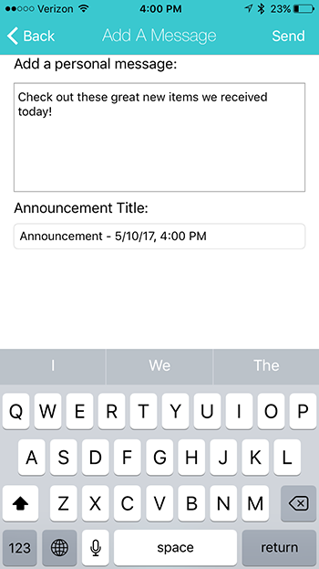

The Message is the field where you can describe the overall group of items in this announcement to your customers. Something like: "Please browse our new inventory from Peru! They just arrived this morning and we have many great treasures...". This is your sales pitch to provide meaning and context to your customers about these new items in this Announcement. Make it good!

Once you have added a message and optionally a title, then you can tap the 'Send' button in the upper right of the Navigation Bar. This will send the announcement to the intended recipients.

### Announcement Complete
Congratulations, you sent your first Announcement! 🍻

Here is what will happen next. The recipients that are subscribed to your wholesale channel and that are using the mobile app, will receive a push notification that will take them directly to your announcement. 

The recipients that you entered as email addresses and the subscribers of your wholesale channel will receive a beautifully formatted email with all the item images, descriptions, and prices, with links back to the app and web site (to allow them to go directly to purchase or discussion of the item).

Happy Selling!

# Summary
We hope this document was helpful to you. We are constantly working on it to make it better, but if you find something that is incorrect, or you find that something is missing, please let us know and we will be quick to address it. Notify us at [docs@grabdibs.com](mailto:docs@grabdibs.com). Thanks.

